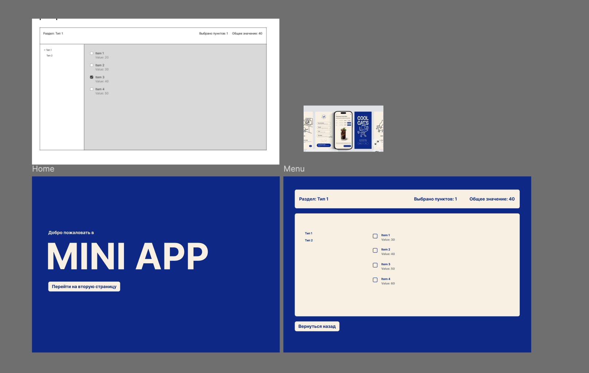
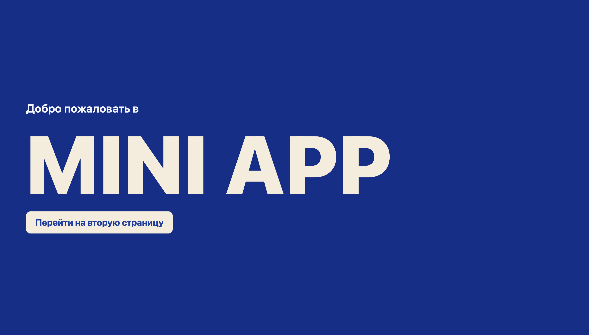
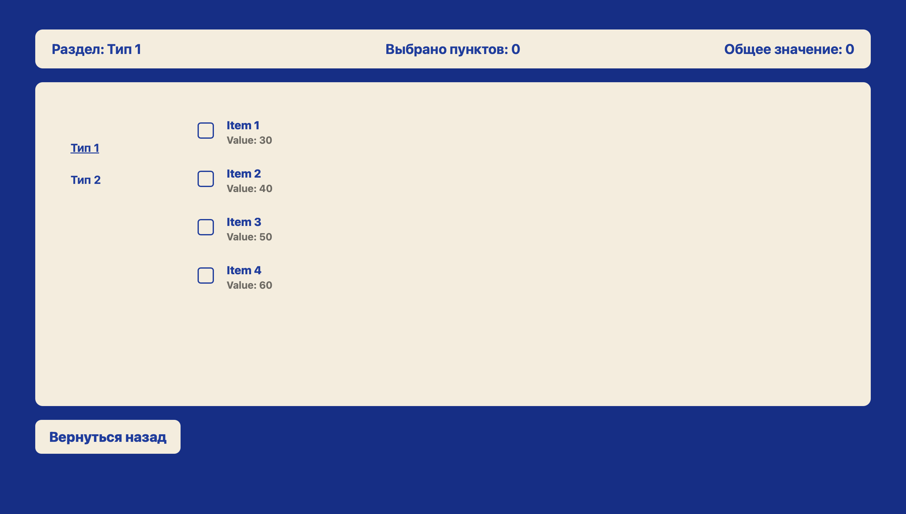

# MiniApp

Мини-приложение на Angular, выполненное в рамках тестового задания по направлению Frontend-разработка.

Перед началом разработки я создала простой дизайн в Figma, чтобы понимать структуру страниц и визуальную композицию интерфейса.

---

## Дизайн



---

## Структура приложения

Приложение состоит из двух страниц.

### 1. Home

Главная страница с приветственным экраном и переходом на вторую страницу.



### 2. Menu

Страница меню содержит:

- два раздела (Тип 1 и Тип 2)
- список элементов с чекбоксами
- отображение текущего раздела
- подсчёт количества выбранных пунктов
- подсчёт общего значения выбранных элементов

Все данные реализованы как статический JSON. Backend не используется.



---

## Стек

- Angular 
- TypeScript
- HTML
- CSS
- GitHub Pages

---

## Запуск локально

```bash
npm install
ng serve
```

После запуска перейти по адресу:

http://localhost:4200/

---

## Онлайн-версия

https://wizoomm.github.io/miniApp/

---

## Использование ИИ

Да, при выполнении задания я использовала ИИ.

Angular для меня новый фреймворк, поэтому ИИ помог мне быстрее сориентироваться в структуре проекта и особенностях настройки. Он выступал как справочник и инструмент для ускорения погружения в незнакомую технологию.

При этом я самостоятельно запускала проект, проверяла работу логики и разбиралась в коде. За два дня практики я изучила основы работы с Angular и сейчас чувствую себя значительно увереннее в использовании этого фреймворка.